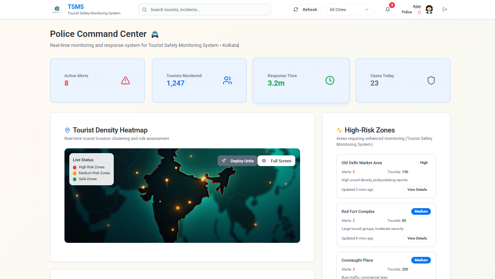

<div align="center">
   
</div>

##  Tourist Safety Monitoring System


## 🚦 Project Overview

**Tourist Safety Monitoring System** is a modern web application designed to enhance travel safety and experience in India. The platform provides dashboards for tourists, police, and administrators, offering real-time information, registration, and support features.


## 🛠️ Tech Stack

- **Frontend Framework:** React
- **Build Tool:** Vite
- **Language:** TypeScript
- **UI Library:** shadcn-ui
- **Styling:** Tailwind CSS


## 👨‍💻 Team Members

- **Sandhosh** (Lead Developer)
- **Pranav** (Frontend Engineer)


## ✨ Features

- Tourist, Police, and Admin dashboards
- User authentication and registration
- Responsive UI for mobile and desktop
- Real-time data visualization


## 🚀 Getting Started

1. **Clone the repository:**
   ```sh
   git clone <YOUR_GIT_URL>
   cd safetravel-india-nexus
   ```
2. **Install dependencies:**
   ```sh
   npm install
   ```
3. **Start the development server:**
   ```sh
   npm run dev
   ```


## 📸 Project Screenshots

<div align="center">
	
	
	
	
	
	
	
</div>

---

<div align="center">
	<sub>Made with ❤️ by Sandhosh & Pranav | For educational and demonstration purposes</sub>
</div>
